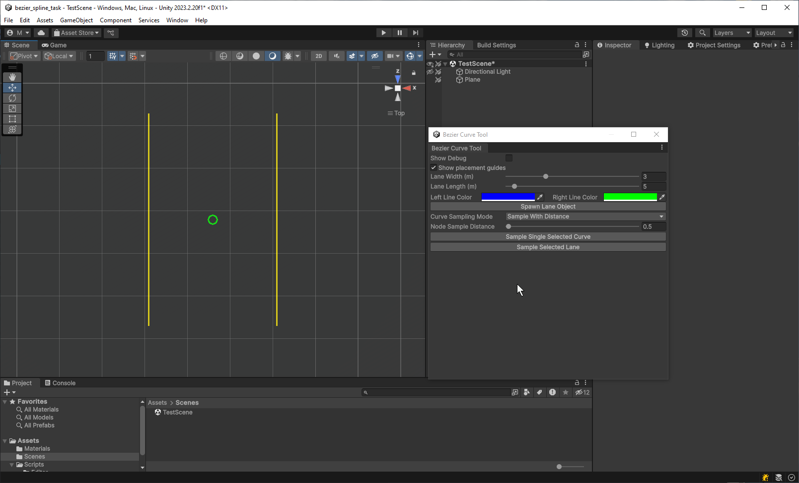

# Bezier Curve Tool for Unity Editor

## Description
A Unity Editor extension for creating and editing Bezier curves directly in the Scene View. Useful for visualizing paths, lanes, or other curve-based systems in level design or gameplay tools.
## Features

- Create and edit Bezier curves in the Unity Editor.
- Visualize curves directly in the Scene View.
- Adjust control points and subdivisions.
- Sample evenly spaced points along curves.
- Define lane width and length for automated lane generation.
- Toggle debug gizmos and placement guides.

## Usage

1. **Open the `TestScene.unity`** from the `Scenes` folder.
   > ⚠️ *Note: This tool works in the Unity Editor only. It uses raycasts from the center of the Scene View to interact with meshes in the scene.*
   
2. **Launch the tool** from the top menu:  
   `Window > Bezier Curve Tool`

3. **Set `Lane Width` and `Lane Length`.**

4. Click **`Spawn Lane Object`** to generate a Lane Object containing 2 Bezier curves.

5. **Select and manipulate curves** directly in the Scene View.

   

6. Choose a **`Curve Sampling Mode`** and enter a value.

7. After adjusting the curves, use either:
   - `Sample Single Selected Curve`
   - `Sample Selected Lane`  
     ...to generate sample points and holders.

   

8. You can **readjust the curves and resample** points at any time using the same buttons.

### Toggling Gizmos

- Enable **Debug Gizmos** with the `Show Debug` checkbox.
- Show or hide **placement guides** using the `Show Placement Guides` checkbox.

  

> **Info:** All bezier lines can be individually edited from the inspector.